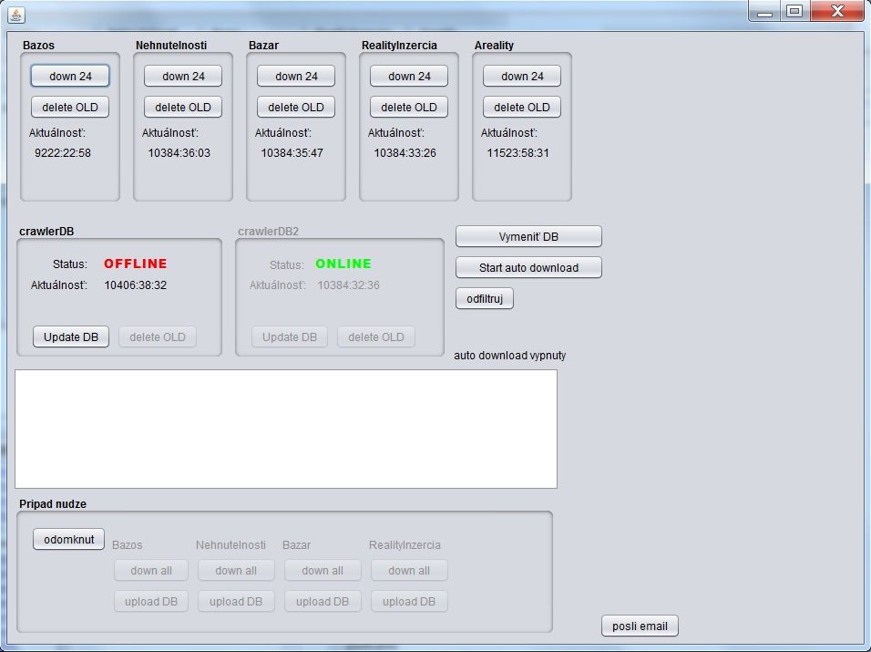

# CrawlerInzeratov
*java desktop app for downloading user advertisements from various estate agency websites*

Kod je uz zastarany pretoze v dobe jeho vzniku som nemal znalosti z oblasti viacvlaknoveho programovania.

Program crawloval vybrane portaly a ziskane nove inzeraty odosielal na vzdialeny server z ktoreho ich [ManazerInzeratov](https://github.com/janmurin/ManazerInzeratov) stahoval a zobrazoval na styl email clienta. 

